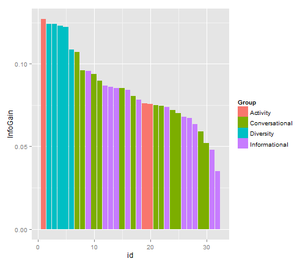
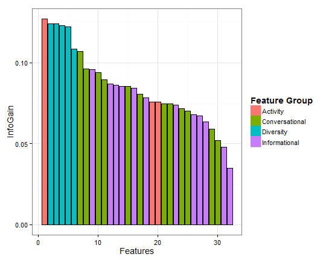

Plotting Info Gain as Teng, Adamic, Lin paper
========================================================

We want to produce similar plot as Figure 8 in http://arxiv.org/abs/1111.3919

**Recipe recommendation using ingredient networks** (2012)
Chun-Yuen Teng, Yu-Ru Lin, Lada A. Adamic


```r
setwd("C:\\Users\\Denis\\Dropbox\\HT2014Twitter\\data")
df.infog <- read.csv("featureInfoGain.csv", header = TRUE)
str(df.infog)
```

```
## 'data.frame':	32 obs. of  4 variables:
##  $ id      : int  1 2 3 4 5 6 7 8 9 10 ...
##  $ Feature : Factor w/ 32 levels "bipartite.authority",..: 31 5 1 2 4 3 28 26 13 21 ...
##  $ InfoGain: num  0.127 0.124 0.124 0.123 0.122 ...
##  $ Group   : Factor w/ 4 levels "Activity","Conversational",..: 1 3 3 3 3 3 2 2 4 2 ...
```

```r
head(df.infog)
```

```
##   id               Feature InfoGain     Group
## 1  1     totalTweetsNumAll   0.1270  Activity
## 2  2         bipartite.hub   0.1239 Diversity
## 3  3   bipartite.authority   0.1239 Diversity
## 4  4 bipartite.betweenness   0.1229 Diversity
## 5  5      bipartite.degree   0.1221 Diversity
## 6  6   bipartite.closeness   0.1084 Diversity
```


You can also embed plots, for example:


```r
library(ggplot2)
ggplot(data = df.infog, aes(x = id, y = InfoGain, fill = Group)) + geom_bar(stat = "identity")
```

 


Another version of the plot

```r
ggplot(data = df.infog, aes(x = id, y = InfoGain, fill = Group)) + geom_bar(stat = "identity") + 
    geom_bar(stat = "identity", colour = "black", show_guide = FALSE) + theme_bw(base_size = 14, 
    base_family = "") + xlab("Features") + theme(legend.title = element_text(size = 14, 
    face = "bold")) + scale_fill_discrete(name = "Feature Group")
```

 

